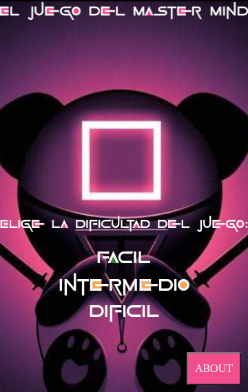
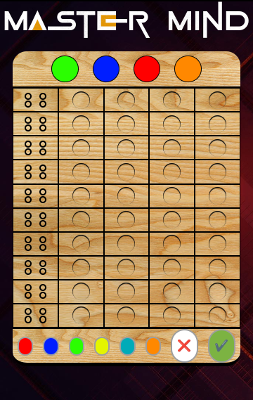
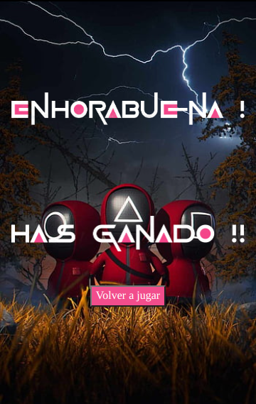
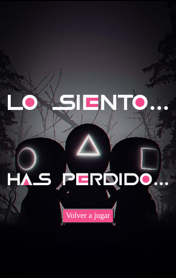
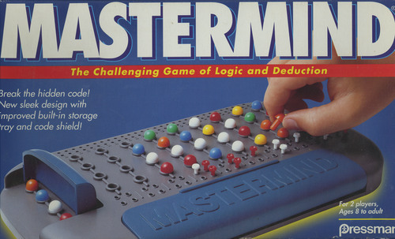
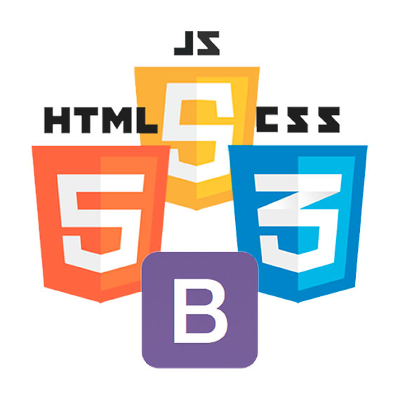

##### Juego Master Mind con JavaScript. 
 

###### Página principal: Selección de dificultad

###### Selección de colores

###### Tablero de juego

###### Página de victoria

###### Página derrota

 

   

#  Contenido:
 

- ### [Descripción del proyecto 📋](#Descripción-del-proyecto)
- ### [Acerca de 🔴](#Acerca)
- ### [Desarrollo 🖥️](#Desarrollo)
- ### [Repositorio GitHub 💾](#Repositorio)
- ### [Licencia y Copyright 📜](#Licencia)

    

### Descripción del proyecto
<!--   -->

#####  Este proyecto se basa en una replica funcional del juego Master Mind.

    

### Acerca de 

 

####  -Mastermind (Español "Mente maestra") es un juego de mesa, de ingenio y reflexión.
####  - Se juega en un tablero con fichas blancas y negras pequeñas y de otros colores, de un tamaño algo superior. Uno de los jugadores escoge un número de fichas de colores, 4 en el juego original, y pone un código secreto oculto del otro jugador. Este, tomando fichas de colores del mismo conjunto, aventura una posibilidad contestada con negras (fichas de color bien colocadas) o blancas (fichas de color con el color correcto, pero mal colocadas).

####  -Termina al averiguarse la combinación (es decir, se consigue una combinación con cuatro negras), o bien se agota el tablero (depende del tamaño, aunque generalmente son 15 combinaciones).

####  -Mastermind es actualmente una marca comercial propiedad de Pressman Toys; el origen puede derivar de un juego tradicional inglés denominado Toros y vacas, se jugaba sobre papel: los "toros" equivalían a las fichas negras, y las "vacas" a las blancas.

####  -En el museo del juguete de Dénia (Alicante) se expone este juego bajo el nombre comercial de Conygan. De la fábrica de juguetes Cayro y año de fabricación 1.965.

    

### Desarrollo 🚧(aún en desarrollo)🚧.

 

####    Para este proyecto se ha utilizado HTML, CSS/Layout, BOOSTRAP y JavaScript, también contiene imágenes descargadas de internet.

####  El proyecto se basa en varias páginas enlazadas entre ellas y guardando la información en un Session Storage.
####  -La página principal que contiene la selección de la dificultad de juego y un botón que redirige a la página about que contiene las instrucciones de juego. Al escoger la dificultad redirige a la página que contiene la selección de colores.
####  - La página de selección de color contiene un color picker que al pulsar en el se despliega una paleta de colores en la que se escoge el color y pulsar el botón seleccionar para validar el color y se mostrará debajo la selección actual. Según la dificicultad (Fácil, intermedio y difícil) se tendrá escoger una cantidad específica de colores (4,5 y 6) respectivamente. No se podrá repetir ningún color. Al llegar a la cantidad de colores requerida redirigirá automaticamente al tablero de juego.
####  - El tablero tiene en la parte superior la combinación secreta aleatoria que estará oculta(actualmente está al descubierto para la comodidad del desarrollo) y se descubrirá al ganar o perder. El centro del tablero contiene todas las celdas que se van a ir llenando con cada jugada en orden de arriba a abajo. La parte de abajo contiene los botones con los colores elegidos previamente, un boton para borrar la selección de uno en uno y el botón de validar que habrá que pulsar al escoger todos los colores de cada fila para validar la jugada.
####  - Al ganar o perder redirigirá automaticamente a dos páginas con 2 mensajes distintos de victoria o derrota y un botón para volver a jugar que redirige a la página de selección de dificultad.

   

    

### Repositorio GitHub

 

#### https://github.com/xIMet3/juegoMasterMind

    

### Licencia y Copyright

 

#### DERECHOS DE PROPIEDAD INTELECTUAL E INDUSTRIAL

####  - Todos los derechos de autor y copiright pertenecen a Mastermind Academy S.L .
 
 

